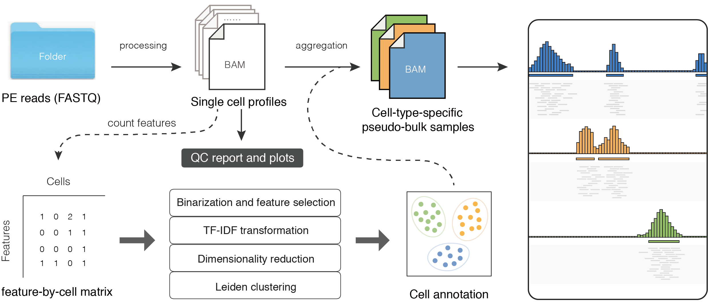

# CUT&RUNTools 2.0

#### *A tool for bulk and single-cell CUT&RUN/CUT&Tag data processing and analysis*

## Overview

CUT&RUNTools 2.0 is a major update of CUT&RUNTools [(link)](https://bitbucket.org/qzhudfci/cutruntools/), including a set of new features specially designed for CUT&RUN and CUT&Tag experiments. Both of the bulk and single-cell data can be processed, analyzed and interpreted using CUT&RUNTools 2.0.

## Main Features

*Single-cell data analysis*

- raw data processing in parallel
- quality assessment and visualization
- feature-by-cell matrix construction  
- dimensionality reduction and clustering analysis  
- cell-type-specific pseudo-bulk data analysis  
 

*Bulk data analysis update* 

- supporting spike-in sequence alignment and data normalization
- options of experiment for CUT&RUN or CUT&Tag data analysis  
- flexiable option for fragments selections (>120bp) 
- supporting different peak calling strategies 
- new functions for peaks annotation 
- compatiable with more computational platforms  


## Installation and Requirement
Please refer to [Installation Instructions](docs/INSTALL.md).

## Bulk data analysis

To learn new features for CUT&RUNTools 2.0 on the bulk data analysis, please see [New features](docs/bulk-news.md).


Once the package is installed, see [Data Example](docs/bulk-QUICK.md) for examples.

See [Usage Page](docs/bulk-USAGE.md) about how to set up the pipeline and detailed usage. 

See [Directory Structure](docs/bulk-DIRECTORY.md) for basic structure of input and output folders.  


## Single-cell data analysis

To get started, please see [Overview](docs/sc-OVERVIEW.md).  

See [Data Example](docs/sc-QUICK.md) for a most excellent starting point to get familiar with the tool.  

See [Usage Page](docs/sc-USAGE.md) about how to set up the pipeline and detailed usage.  

See [Directory Structure](docs/sc-DIRECTORY.md) for basic structure of input and output folders.

<div align=center>  </div> 

<p align="center">The schematic view of the single-cell data processing module of CUT&RUNTools</p>  


## FAQs:  

1. MEME does not work (well discussed in [issue 20](https://github.com/fl-yu/CUT-RUNTools-2.0/issues/20), [issue 15](https://github.com/fl-yu/CUT-RUNTools-2.0/issues/15), [issue 2](https://github.com/fl-yu/CUT-RUNTools-2.0/issues/2))  
potential solution: re-install MEME with either command
```
conda config --add channels defaults
conda config --add channels bioconda
conda config --add channels conda-forge

conda create -n meme meme=5.0.5 python=3.7
conda activate meme
```
```
conda create -n meme python=3.6
conda activate meme
conda install ‘meme=5.0.2’ ‘icu=58.2’
```
If it still does not work well, you could try to install MEME manually ([issue 7](https://github.com/fl-yu/CUT-RUNTools-2.0/issues/7)). Please make sure you used the correct version, some users reported the latest version of MEME was not compatible at some points.
## News:  

*Here are the new updates after first publication of CUT&RUNTools 2.0 (07/9/2021).*  
*We are really appreciated that all the users who used this tool and gave the feedback, riased issues, fixed the bugs and pulled requests, with us together to make this tool better.*  

09/02/2021 - support different types of adaptor processing (bulk) [[details](https://github.com/fl-yu/CUT-RUNTools-2.0/issues/24)]  
08/26/2021 - A singularity definition [file](https://github.com/fl-yu/CutRunTools2_singularity) for installation on their HPC cluster, thanks to [qiyubio](https://github.com/qiyubio)  
07/29/2021 - bugs fixed in spike-in normalization (bulk)  
07/23/2021 - add the scripts for get cut profiles of single locus/whole genome [[details](https://github.com/fl-yu/CUT-RUNTools-2.0/issues/10)]  
07/21/2021 - bugs fixed

## Cite our paper:  
Please cite our paper if you used/adapted CUT&RUNTools 2.0 in your study  

***Yu et al., CUT&RUNTools 2.0: a pipeline for single-cell and bulk-level CUT&RUN and CUT&Tag data analysis, Bioinformatics, 2021 [PubMed](https://pubmed.ncbi.nlm.nih.gov/34244724/).***  

If you run into issues and would like to report them, you can use the "Issues" tab on the left hand side.  
Alternatively, you can contact authors: fyu{at}broadinstitute.org or guo-cheng.yuan{at}mssm.edu .  


