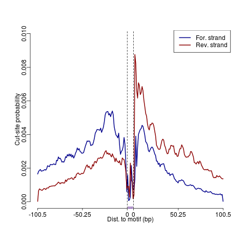
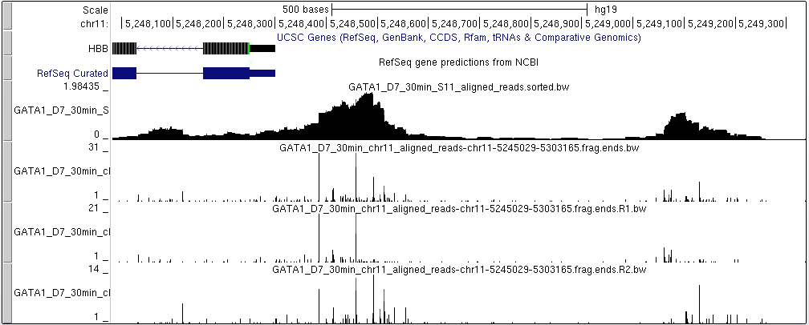

## Usage of CUT&RUNTools 2.0 for bulk data analysis

## Defining a configuration file

CUT&RUNTools requires a JSON configuration file (named as `bulk-config.json`) which specifies all that is needed to run an analysis. 
A sample configuration file is below. 


<!-- end list -->

``` json
{
    "software_config": {
        "Rscriptbin": "/path/to/R/3.3.3/bin", 
        "pythonbin": "/path/to/python/2.7.12/bin", 
        "perlbin": "/path/to/perl/5.24.0/bin",
        "javabin": "/path/to/java/jdk-1.8u112/bin",
        "bowtie2bin": "/path/to/bowtie2/2.2.9/bin", 
        "samtoolsbin": "/path/to/samtools/1.3.1/bin", 
        "macs2bin": "/path/to/macs2/2.1.1.20160309/bin", 
        "memebin": "/home/user/meme/bin", 
        "bedopsbin": "/path/to/bedops/2.4.30", 
        "bedtoolsbin": "/path/to/bedtools/2.26.0/bin", 
        "path_deeptools": "/path/to/deeptools",
        "bt2idx": "/n/groups/bowtie2_indexes", 
        "genome_sequence": "/home/user/chrom.hg19/hg19.fa", 
        "spike_in_bt2idx": "/n/groups/ecoli/bowtie2_indexes", 
        "spike_in_sequence": "/home/user/chrom.ecoli/ecoli6.fa", 
        "extratoolsbin": "/path/to/cutrun_pipeline2.0", 
        "extrasettings": "/path/to/cutrun_pipeline2.0",
        "kseqbin": "/path/to/cutrun_pipeline2.0", 
        "adapterpath": "/path/to/cutrun_pipeline2.0/adapters", 
        "trimmomaticbin": "/path/to/cutrun_pipeline2.0", 
        "picardbin": "/path/to/cutrun_pipeline2.0", 
        "picardjarfile": "picard-2.8.0.jar", 
        "trimmomaticjarfile": "trimmomatic-0.36.jar", 
        "makecutmatrixbin": "/home/user/.local/bin"
    }, 
    "input_output": {
        "fastq_directory": "/n/scratch2/user/Nan_18_demo/sorted.chr11", 
        "workdir": "/n/scratch2/user/workdir", 
        "fastq_sequence_length": 42, 
        "organism_build": "hg19",
        "spike_in_align": "FALSE",
        "spike_in_norm": "FALSE",
        "spikein_scale": "10000",
        "frag_120": "TRUE",
        "peak_caller": "macs2",
        "dup_peak_calling": "FALSE",
        "cores": "8",
        "experiment_type": "CUT&Tag"
    }, 
    "motif_finding": {
        "num_bp_from_summit": 150, 
        "num_peaks": 1000, 
        "total_peaks": 5000, 
        "motif_scanning_pval": 0.0005, 
        "num_motifs": 10
    }
}

```

- The **software_config** section defines the software paths for various sequencing tools.  

- The **input_output** section contains the general parameters for the data processing.

``` 
PARAMETERS
----------

	[fastq_directory]: A folder containing all the fastq files of barcode cells, pattern with ***_R1_001.fastq.gz
		and ***_R2_001.fastq.gz 
			options: NO default 
			 			
	[workdir]: A folder containg all the output of data processing and analysis
			options: NO default 
			
	[fastq_sequence_length]: Read length of the fastq files
			options: 42 (default) 		
	
	[organism_build]: Reference genome version 
			options: hg38, hg19 (default), mm10 or mm9
			 			
	[spike_in_align]: Whether align the trimmed fastq files to the spike-in genome. Make sure you provided 
	      the spike-in genome information if you set this as TRUE
			options: TRUE or FALSE (default)
			 			
	[spike_in_norm]: Whether normalize the signal file (bigwig) based on spike-in reads. Note that the
		normalization will not be performed if the spike-in reads number is 0.
			options: TRUE or FALSE (default)
			 			
	[spikein_scale]: A scale number for spike-in normalization. The scale factor is calculated as (spikein_scale)/(spike-in reads) 
			options: 10000 (default) 
			 			
	[frag_120]: Whether filter the bam files based on the cretiria of fragment size 120
			options: TRUE (default) or FALSE 
			 			
	[peak_caller]: To specify statistical significant peaks called from macs2 or SEACR method used for 
		further analysis. The peak calling results of three strategies (macs2 narrow peaks, macs2 broad
		peaks and seacr peaks) can be found in the 'peakcalling' directory. he narrow peak mode is suitable for a  
	      typical TF, while the broad peak mode is good to use for the chromatin factors generally having 
	      a large binding domain or epigenetic modification such as H3K27me3 or H3K9me3 having dispersed 
	      localization
			options: macs2 (default) or SEACR
			 			
	[dup_peak_calling]: Whether the reads with duplication will be used in the peak calling step 
			options: TRUE or FALSE (default)
			
	[cores]: How many threads will be used by parallel in the software such as bowtie2 and samtool..
			options: 8	
			 			
	[experiment_type]: CUT&Tag reads (bam files) should be shifted + 4 bp and − 5 bp for positive and 
		negative strand respectively, to account for the 9-bp duplication created by DNA repair of the nick 
		by Tn5 transposase and achieve 	base-pair resolution of TF footprint and motif-related analyses.  
			options: CUT&RUN or CUT&Tag (default)
			 			

```

- The **motif_finding** section includes the parameters controlling TF motif De Novo and footprinting steps, these four parameters are same to the last version.  


### Four-step process for executing CUT&RUNTools 2.0

Step 1. **Read trimming, alignment.** 

The parameter is the fastq file. Even though we specify the _R1_001.fastq.gz, CUT&RUNTools actually checks that both forward and reverse fastq files are present. Always use the _R1_001 of the pair as parameter of this command.

Step 2. **BAM processing, peak calling.** It marks duplicates in bam files, and filter fragments by size. Then it performs peak calling using MACS2 and SEACR. It runs both.

CUT&RUNTools varies through different peak calling settings and generates multiple results for these settings in the following directories. Based on the results, users should **select only one setting** to go to steps 3 & 4.

Which directory to use: if **TF CUT&RUN**, I prefer **macs2.narrow.120** or **macs2.narrow.dedup.120**. If **histone CUT&RUN**, use **macs2.broad.all**. If **SEACR**, use **seacr.all.frag** (histone) or **seacr.120** (TF) and use the **stringent** peaks within each folder.

Step 3. **Motif finding.** CUT&RUNTools uses MEME-chip for de novo motif finding on sequences surrounding the peak summits.

Step 4. **Motif footprinting.**
 
Beautiful footprinting figures will be located in the directory `fimo.result`. Footprinting figures are created for every motif found by MEME-chip, but only the right motif (associated with TF) will have a proper looking profile. Users can scan through all the motifs' footprints.

# Outputs

CUT&RUNTools generates several outputs including: 1) de novo motifs found by motif searching, 2) aggregate motif footprinting figure, 3) individual motif site binding probability score.

For example, suppose our sample is named "GATA1_D7_30min_S11". We can do the following to access each output.

## De novo motif finding results

```bash
cd peakcalling/macs2.narrow/random.10000
ls -ltr
```
```
total 4580
drwxrwxr-x 34 qz64 qz64    4096 Dec  2 23:51 MEME_LRF_HDP2_30min_S15_aligned_reads_shuf
-rw-rw-r--  1 qz64 qz64 1033018 Dec  2 23:51 GATA1_D7_30min_S11_aligned_reads_peaks.narrowPeak
drwxrwxr-x  2 qz64 qz64    4096 Dec  2 23:51 summits
drwxrwxr-x  2 qz64 qz64    4096 Dec  2 23:51 padded.fa
drwxrwxr-x 52 qz64 qz64    4096 Dec  2 23:51 MEME_GATA1_D9_30min_S12_aligned_reads_shuf
-rw-rw-r--  1 qz64 qz64  824697 Dec  2 23:51 GATA1_KO_30min_S14_aligned_reads_peaks.narrowPeak
drwxrwxr-x  2 qz64 qz64    4096 Dec  2 23:51 padded
-rw-rw-r--  1 qz64 qz64 1039845 Dec  2 23:51 GATA1_HDP2_30min_S13_aligned_reads_peaks.narrowPeak
drwxrwxr-x 56 qz64 qz64    4096 Dec  2 23:51 MEME_GATA1_HDP2_30min_S13_aligned_reads_shuf
drwxrwxr-x 46 qz64 qz64    4096 Dec  2 23:51 MEME_GATA1_KO_30min_S14_aligned_reads_shuf
-rw-rw-r--  1 qz64 qz64  720325 Dec  2 23:51 LRF_HDP2_30min_S15_aligned_reads_peaks.narrowPeak
-rw-rw-r--  1 qz64 qz64 1030170 Dec  2 23:51 GATA1_D9_30min_S12_aligned_reads_peaks.narrowPeak
drwxrwxr-x 54 qz64 qz64    4096 Dec  3 11:25 MEME_GATA1_D7_30min_S11_aligned_reads_shuf
```

```bash
cd MEME_GATA1_HDP2_30min_S13_aligned_reads_shuf
cat summary.tsv
```

```
MOTIF_INDEX	MOTIF_SOURCE	MOTIF_ID	ALT_ID	CONSENSUS	WIDTH	SITES	E-VALUE	E-VALUE_SOURCE	MOST_SIMILAR_MOTIF_SOURCE	MOST_SIMILAR_MOTIF	URL
1	MEME	AGATAAGV	MEME-1	AGATAAGV	8	410	1.6e-1288	MEME	 	 	 
2	DREME	HGATAA	DREME-1	HGATAA	6	7298	1.8e-1161	DREME	 	 	 
3	DREME	GATAAR	DREME-24	GATAAR	6	321	9.8e-816	DREME	 	 	 
4	DREME	AGATA	DREME-22	AGATA	5	826	4.2e-654	DREME	 	 	 
5	DREME	CWGATA	DREME-14	CWGATA	6	821	1.1e-432	DREME	 	 	 
6	DREME	AGATABS	DREME-4	AGATABS	7	1422	1.4e-147	DREME	 	 	 
7	DREME	CMCRCCC	DREME-2	CMCRCCC	7	1559	5.5e-100	DREME	 	 	 
8	DREME	TGAGTCAB	DREME-3	TGAGTCAB	8	744	2.0e-095	DREME	 	 	 
9	DREME	HGATTA	DREME-7	HGATTA	6	1662	2.7e-091	DREME	 	 	 
10	MEME	TGAGTCAY	MEME-4	TGAGTCAY	8	55	6.5e-082	MEME	 	 	 
11	DREME	RVCCACA	DREME-5	RVCCACA	7	1558	1.4e-045	DREME	 	 	 
12	DREME	CHGCC	DREME-6	CHGCC	5	8862	9.0e-033	DREME
```

The file summary.tsv shows the list of motifs that are found by motif searching.

Download the entire folder `MEME_GATA1_D7_30min_S11_aligned_reads_shuf`. Then go in and open `index.html` to see a comprehensive motif report.


## Motif footprinting result and binding log odds scores

CUT&RUNTools generates a motif footprinting plot for each de novo motif that is found by the previous step.
Motif footprinting results are located in `fimo.result` directory.


```bash
cd peakcalling/macs2.narrow/random.10000/MEME_GATA1_HDP2_30min_S13_aligned_reads_shuf
```

```
cd ../../fimo.result
ls -ltr
```
```
total 20
drwxrwxr-x 38 qz64 qz64 4096 Dec  2 23:51 GATA1_D7_30min_S11_aligned_reads_peaks
drwxrwxr-x 36 qz64 qz64 4096 Dec  2 23:51 GATA1_D9_30min_S12_aligned_reads_peaks
drwxrwxr-x 34 qz64 qz64 4096 Dec  2 23:51 GATA1_KO_30min_S14_aligned_reads_peaks
drwxrwxr-x 19 qz64 qz64 4096 Dec  2 23:51 LRF_HDP2_30min_S15_aligned_reads_peaks
drwxrwxr-x 43 qz64 qz64 4096 Dec  2 23:51 GATA1_HDP2_30min_S13_aligned_reads_peaks
```

The `fimo.result` directory is organized by samples. Within each sample, you will see the footprints organized by de novo motifs.

```
cd GATA1_HDP2_30min_S13_aligned_reads_peaks/
ls
```
```
fimo2.DREME-10.CCWATCAG  fimo2.DREME-20.CCCTYCC   fimo2.DREME-5.RVCCACA               fimo2.MEME-31.TGGGCASMSTGCCAG
fimo2.DREME-11.CTCCWCCC  fimo2.DREME-21.ASAGGAAG  fimo2.DREME-6.CHGCC                 fimo2.MEME-32.TSAGAGGCAGC
fimo2.DREME-12.CACGTG    fimo2.DREME-22.AGATA     fimo2.DREME-7.HGATTA                fimo2.MEME-39.TTMKCAGCTGGGTRSASCASC
fimo2.DREME-13.CAKCTGB   fimo2.DREME-23.ACAGAMA   fimo2.DREME-8.ACTTCCKB              fimo2.MEME-3.RGGGYGGGGCC
fimo2.DREME-14.CWGATA    fimo2.DREME-24.GATAAR    fimo2.DREME-9.GTTTCY                fimo2.MEME-46.CCYCCTAGTGR
fimo2.DREME-15.CACACASA  fimo2.DREME-25.AAAAAAAA  fimo2.MEME-10.GCCCTGGSYGBTGGC       fimo2.MEME-4.TGAGTCAY
fimo2.DREME-16.CAKTTCC   fimo2.DREME-26.AAACAYA   fimo2.MEME-17.CRGGGRCTGGGCAG        fimo2.MEME-50.GTGGCCAC
fimo2.DREME-17.AGAAAAC   fimo2.DREME-27.CGCADGCG  fimo2.MEME-18.ACCACARACCA           fimo2.MEME-6.CAATTAYTTGVTMAGAGCAAACYWGAAGG
fimo2.DREME-18.GTCAC     fimo2.DREME-2.CMCRCCC    fimo2.MEME-1.AGATAAGV
fimo2.DREME-19.CCAATCGB  fimo2.DREME-3.TGAGTCAB   fimo2.MEME-2.GCAYBCTGGGAADYGTAGTYY
fimo2.DREME-1.HGATAA     fimo2.DREME-4.AGATABS    fimo2.MEME-30.CYTCCCACAGC
```
The ID of each motif corresponds to that in the `summary.tsv` in previous step.
Let us take a look at the motif footprint of HGATAA motif.

```bash
cd fimo2.DREME-1.HGATAA
ls 
```
```
cisml.xml  fimo.bed  fimo.cuts.freq.txt  fimo.gff  fimo.html  fimo.lambda.txt  fimo.logratio.txt  fimo.png  fimo.postpr.txt  fimo.txt  fimo.xml
```

**The file fimo.png contains the motif footprinting figure.**



**The file fimo.logratio.txt shows the posterior binding log-odds score for all motif sites (as shown in fimo.bed file). We can sort all the sites by binding log odds score by the following.**

```
paste fimo.bed fimo.logratio.txt|sort -t $'\t' -g -k7 -r > fimo.logratio.sorted.bed
cat fimo.logratio.sorted.bed
```
```
chr19   51161579        51161585        1-HGATAA-2-chr19        34.5    +       210.558477451988
chr19   51161526        51161532        1-HGATAA-1-chr19        34.5    +       179.033305023544
chr1    33223206        33223212        1-HGATAA-1-chr1 34.5    +       160.872851137722
chr14   103844534       103844540       1-HGATAA-1-chr14        34.5    -       155.321221174099
chr3    25645929        25645935        1-HGATAA-1-chr3 34.5    +       155.278568036591
chr6    10750100        10750106        1-HGATAA-1-chr6 34.5    -       142.401808525619
chr8    40457444        40457450        1-HGATAA-2-chr8 34.5    -       142.322297190559
chr8    27173054        27173060        1-HGATAA-1-chr8 34.5    -       131.213839588474
chr6    42060095        42060101        1-HGATAA-1-chr6 34.5    +       130.3885615178
chr9    6780043 6780049 1-HGATAA-2-chr9 34.5    -       125.950052746736
chr9    6780054 6780060 1-HGATAA-1-chr9 34.5    +       121.898538411992
chr13   52165301        52165307        1-HGATAA-1-chr13        34.5    +       120.932931896737
chr20   44844659        44844665        1-HGATAA-1-chr20        34.5    -       120.231198400945
chr1    114457022       114457028       1-HGATAA-1-chr1 34.5    +       118.77630603718
chr21   46274925        46274931        1-HGATAA-1-chr21        34.5    +       118.382887040806
chr19   10727908        10727914        1-HGATAA-1-chr19        34.5    -       117.173605700489
chr11   27442450        27442456        1-HGATAA-3-chr11        34.5    +       115.467998429997
chr6    3251929 3251935 1-HGATAA-1-chr6 34.5    -       114.091191286861
```
**The last column above shows the binding log odds score.**

In summary, the important output files are located below:
```
macs2.narrow.aug18/random.10000/MEME_GATA1_HDP2_30min_S13_aligned_reads_shuf/summary.tsv
macs2.narrow.aug18/fimo.result/GATA1_HDP2_30min_S13_aligned_reads_peaks/fimo2.DREME-1.HGATAA/fimo.bed
macs2.narrow.aug18/fimo.result/GATA1_HDP2_30min_S13_aligned_reads_peaks/fimo2.DREME-1.HGATAA/fimo.logratio.txt
macs2.narrow.aug18/fimo.result/GATA1_HDP2_30min_S13_aligned_reads_peaks/fimo2.DREME-1.HGATAA/fimo.png
```

## Single locus cut profile

CUT&RUNTools allows users to obtain a single nucleotide resolution cut profile for a region of interest.

This will require a bam file that CUT&RUNTools created (preferrably a bam in `aligned.aug18/dup.marked.120bp` folder), and a region of interest (in the format chr11:5245029-5303165).

The script that is needed is `get_cuts_single_locus.sh`. There is one copy of this in `macs2.narrow.aug18` in the work directory, and in each peak calling result directory in the work directory.
Use the script in the appropriate peak calling directory for your purpose (for example, if TF, use macs2.narrow.aug18, but if histone, use macs2.broad.all.frag.aug18).

```
#construct single locus profile keeping duplicates in bam
pwd
cd peakcalling/macs2.narrow
./get_cuts_single_locus.sh chr11:5245029-5303165 ../aligned.aug10/dup.marked.120bp/GATA1_D7_30min_chr11_aligned_reads.bam single.locus
```
Here, **the 3 parameters required are: region, bam file path, output directory**. `single.locus` is the output directory.

Once finished, let us check the outputs.

```
cd single.locus
ls -ltr
```

```
-rw-rw-r-- 1 qz64 qz64 306944 Feb  8 22:41 GATA1_D7_30min_chr11_aligned_reads-chr11-5245029-5303165.frag.ends.txt
-rw-rw-r-- 1 qz64 qz64 144936 Feb  8 22:41 GATA1_D7_30min_chr11_aligned_reads-chr11-5245029-5303165.frag.ends.sorted.bed
-rw-rw-r-- 1 qz64 qz64  72468 Feb  8 22:41 GATA1_D7_30min_chr11_aligned_reads-chr11-5245029-5303165.frag.ends.R2.sorted.bed
-rw-rw-r-- 1 qz64 qz64  53822 Feb  8 22:41 GATA1_D7_30min_chr11_aligned_reads-chr11-5245029-5303165.frag.ends.R2.bw
-rw-rw-r-- 1 qz64 qz64  72468 Feb  8 22:41 GATA1_D7_30min_chr11_aligned_reads-chr11-5245029-5303165.frag.ends.R2.bed
-rw-rw-r-- 1 qz64 qz64  34174 Feb  8 22:41 GATA1_D7_30min_chr11_aligned_reads-chr11-5245029-5303165.frag.ends.R2.bdg
-rw-rw-r-- 1 qz64 qz64  72468 Feb  8 22:41 GATA1_D7_30min_chr11_aligned_reads-chr11-5245029-5303165.frag.ends.R1.sorted.bed
-rw-rw-r-- 1 qz64 qz64  45585 Feb  8 22:41 GATA1_D7_30min_chr11_aligned_reads-chr11-5245029-5303165.frag.ends.R1.bw
-rw-rw-r-- 1 qz64 qz64  72468 Feb  8 22:41 GATA1_D7_30min_chr11_aligned_reads-chr11-5245029-5303165.frag.ends.R1.bed
-rw-rw-r-- 1 qz64 qz64  33738 Feb  8 22:41 GATA1_D7_30min_chr11_aligned_reads-chr11-5245029-5303165.frag.ends.R1.bdg
-rw-rw-r-- 1 qz64 qz64 306944 Feb  8 22:41 GATA1_D7_30min_chr11_aligned_reads-chr11-5245029-5303165.frag.ends.checked.txt
-rw-rw-r-- 1 qz64 qz64  58596 Feb  8 22:41 GATA1_D7_30min_chr11_aligned_reads-chr11-5245029-5303165.frag.ends.bw
-rw-rw-r-- 1 qz64 qz64 144936 Feb  8 22:41 GATA1_D7_30min_chr11_aligned_reads-chr11-5245029-5303165.frag.ends.bed
-rw-rw-r-- 1 qz64 qz64  60309 Feb  8 22:41 GATA1_D7_30min_chr11_aligned_reads-chr11-5245029-5303165.frag.ends.bdg
-rw-rw-r-- 1 qz64 qz64   2944 Feb  8 22:41 GATA1_D7_30min_chr11_aligned_reads-chr11-5245029-5303165.bam.bai
-rw-rw-r-- 1 qz64 qz64 188799 Feb  8 22:41 GATA1_D7_30min_chr11_aligned_reads-chr11-5245029-5303165.bam
```

Many of the files in ths folder are intermediary files and can be ignored. The important files are the three bigwigs (`.frag.ends.R1.bw`, `.frag.ends.R2.bw`, and `.frag.ends.bw`). **The R1 and R2 bigwigs designate strand-specific cut profiles that were created. The `frag.ends.bw` is one that combines cuts from both strands.** The bigwigs can be displayed in any visualization tools such as IGV or UCSC genome browser.



